## Labour market disadvantage {.smaller}


::: {.notes}

Common configurations for slides:

{background-image="./img/" background-size="100%"}
{.smaller}
{.scrollable}
{.nonincremental}
{.columns} {.column width="50%"}
{.r-fit-text}

:::


<br>

::: {.columns}


::: {.column width="70%"}
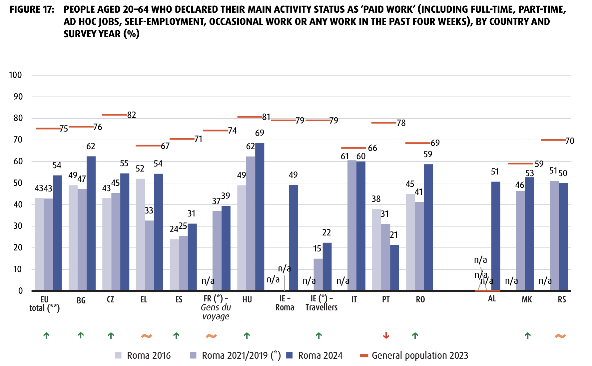{fig-align="center"}
:::

::: {.column width="30%"}
- **22%** of Irish Travellers in paid work (79% overall pop.)
- **31%** of Roma in Spain in paid work (71% overall pop.)
- Differences in education/training levels can only partially explain this employment [@watson_social_2017]

:::

:::

:::{.aside}
Source: European Union Agency for Fundamental Rights. 2025. Rights of Roma and Travellers in 13 European Countries: Perspectives from the Roma Survey 2024. LU: Publications Office.
:::


## Discrimination in the labour marker {.smaller}

<br>

::: {.columns}

::: {.column  width="70%"}
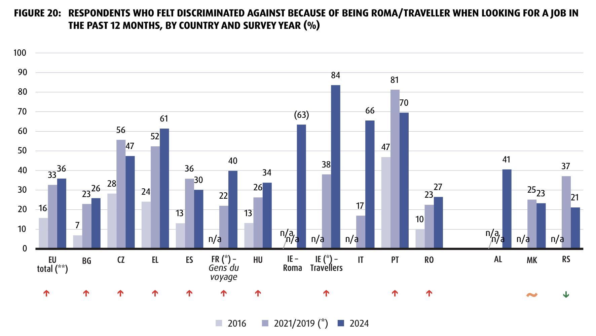{fig-align="center"}
:::

::: {.column width="30%"}
- **84%** of Irish Travellers  
- **31%** Roma in Spain felt discriminated against when looking for a job  
:::
:::

:::{.aside}
Source: European Union Agency for Fundamental Rights. 2025. Rights of Roma and Travellers in 13 European Countries: Perspectives from the Roma Survey 2024. LU: Publications Office.
:::


## Field experiments

- Correspondence studies rely on names as signals for characteristics such as gender, ethnicity, religion, race and class [@elder_signaling_2023; @crabtree_validated_2023; @ghekiere_perception_2025] 

- Differences in perception of the signals transmitted by these names [@martiniello_signaling_2022; @crabtree_racially_2022]

## {.smaller}

::: {.columns}

::: {.column  width="50%"}
{fig-align="center"}  
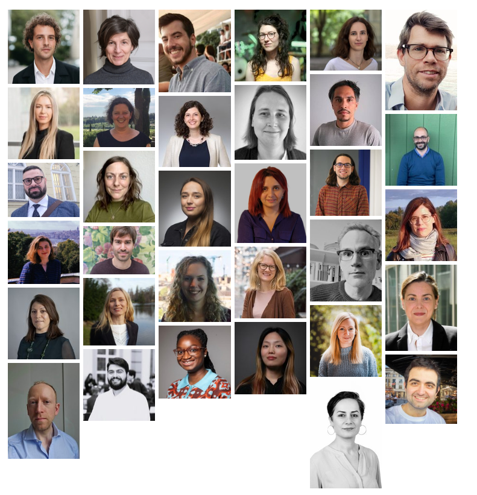{fig-align="center"}  
:::

::: {.column width="50%"}

<br>
<br>
<br>

- Nine countries (BE, CH, CZ, DE, ES, HU, IE, NL, GB)  
- Childcare, Employment, Housing  
- Current study:
  - Employment  
  - Ireland (1,625) and Spain (1,793) 
  - Cook, Electrician, Forkift driver, Clerk, Receptionist, Store assistant, Sales rep., Comms. manager, Software developer
:::
:::

# Field experiment results {background-color="#223451"}

## Callback rates

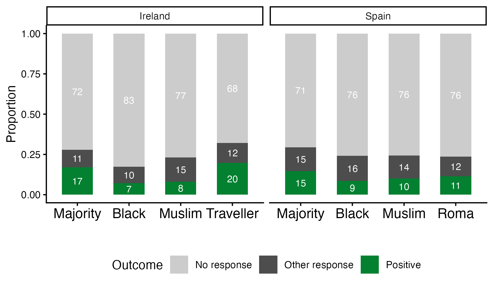{fig-align="center" width=80%}


## Discrimination ratios

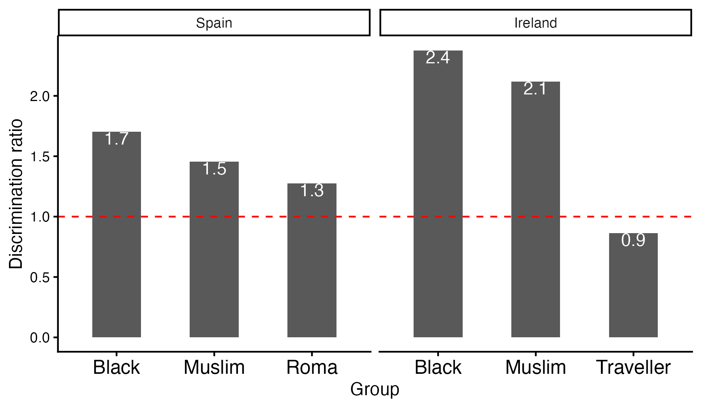{fig-align="center" width=80%}


# Names survey{background-color="#223451"}

## Names survey

- Websurvey conducted between Autumn 2023 and early 2024   
- First names selected among most common on Live Births Registration   
- Surnames selected in consultation with community organisations   
- Ireland: 900 participants assessed 10 names each from a list of 130 names  
- Spain: 512 participants assessed 10 names each from a list 140 names

## Identifying names as ethnic majority

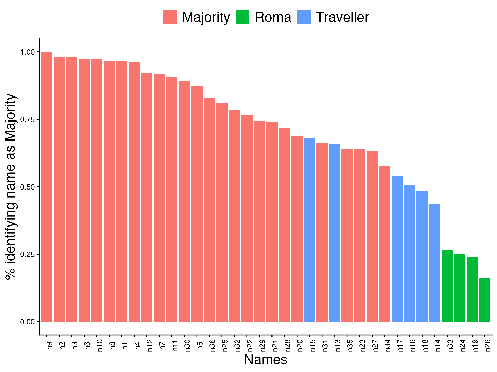{fig-align="center" width=70%}

## Identifying names as ethnic minority

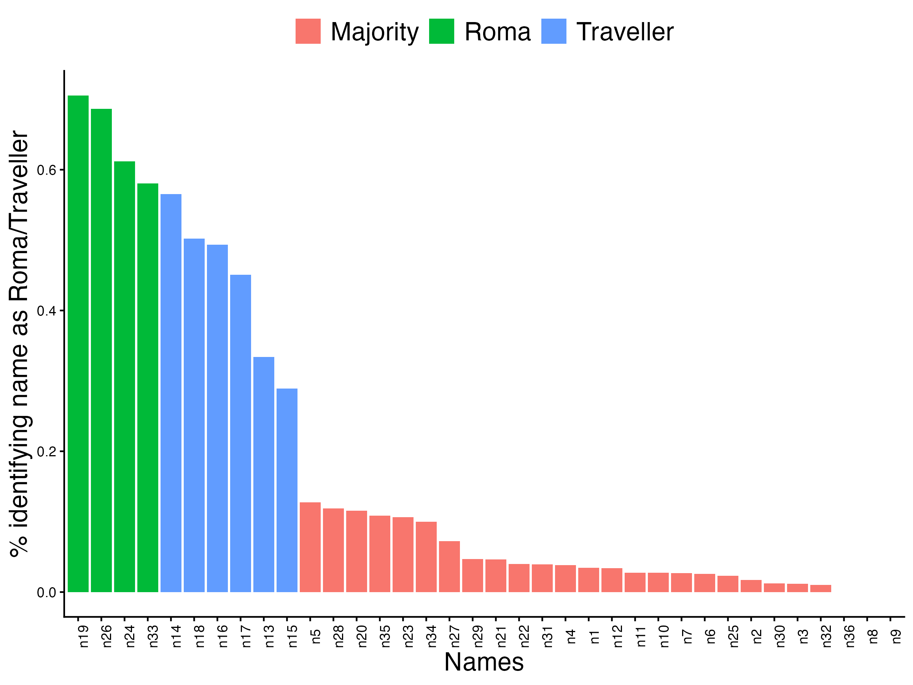{fig-align="center" width=70%}

## SES of names

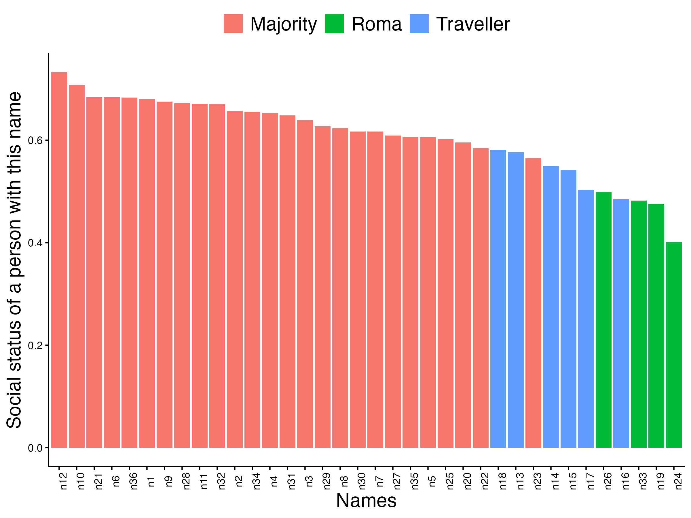{fig-align="center" width=70%}

## Selection of names for the field experiment 

- Majority: Country origin  
- Muslim: Religiosity  
- Black: Skin tone  
- Roma/Travellers: Direct question ethnicity     

## Research question  

<br>


> Is there a relationship between the average signal strength of the name and callback rates?  

<br>

:::{.callout-note title="Signal strength of the name" .fragment .small}
Majority: proportion indicating country of origin   
Muslim: mean value of religiosity scale   
Black: mean value skin tone scale   
Travellers/Roma: proportion indicating expected ethnicity   
:::


# Main results {background-color="#223451"}


## Correlation

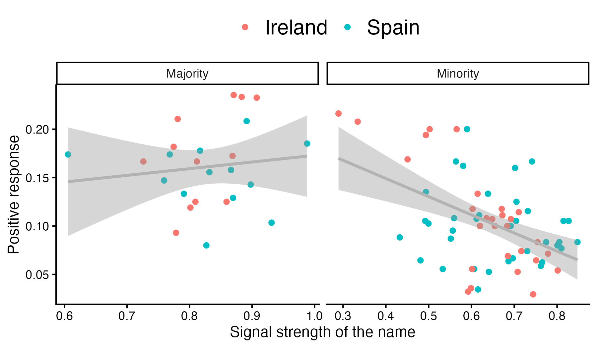{fig-align="center" width=90%}


## Model specification

- Outcome variable: Positive response  
- Main variable: signal strength  
- Linear probability model  
- Pooled sample with country fixed effects  
- Cluster robust standard errors  

## Model main estimates

<br>

```{r}
library(tidyverse) # for data manipulation
library(haven) # to import/export from/to SPSS/STATA formats
library(gt) # formatted tables
library(gtsummary)
library(marginaleffects)

source("../src/0_utils.R")
source("../src/1_import.R")

vars_control <- c(
  "applicant_female", "parent", "app_citizenship", "past_unemployment",
  "fulltime_job", "childcare_success", "housing_success", "occupation"
)

m_naive  <- get_disc_model(
  df_exp, outcome = "lm_positive", covars = c("name_mingroup", "country", vars_control), 
  se = "cluster", cluster_var = "name_applicant"
)

m_signal  <- get_disc_model(
  df_exp, outcome = "lm_positive", covars = c("name_mingroup", "nm_signal_std", "country", vars_control), 
  se = "cluster", cluster_var = "name_applicant"
)


tbl_merge(list(
  tbl_regression(m_naive, include = "name_mingroup", conf.int = FALSE) |> bold_p(),
  tbl_regression(m_signal, include = c("name_mingroup", "nm_signal_std"), conf.int = FALSE) |> bold_p()),
  tab_spanner = c("Model 1", "Model 2"))

```

:::{.aside}
Models include country fixed effects and the following controls: gender, occupation, parental status, citizenship, past unemployment, full time position, childcare success, housing success.
:::

## Interaction between group and signal strength

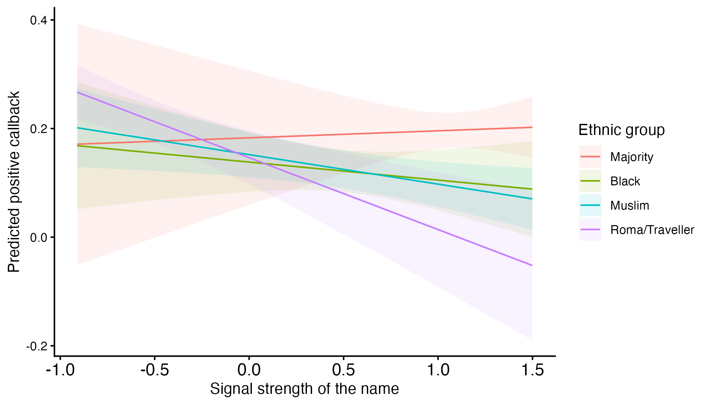{fig-align="center" width=90%}

:::{.aside}
Model includes country fixed effects and the following controls: gender, occupation, parental status, citizenship, past unemployment, full time position, childcare success, housing success.
:::

## Final considerations

- Limitations:  Small number of names, sample hetereogeneity   
- Sensitivity analysis: Invitation and rejection as outcome, logistic regression  
- Next steps: 
  - Name recognition for gatekeepers' profile (cob / education)   
  - Name recognition at the sub-national level   


## Thank you {.hide-logo .inverted }
<br>

Daniel Capistrano ([daniel.capistrano@esri.ie](daniel.capistrano@esri.ie))  
Alvaro Suarez, Mat Creighton, Fran McGinnity, Evan Carron-Kee, Hector Cebolla

<br>

::: {.columns}
::: {.column width="20%" text-align="center"}
{fig-align="center"}

:::{style="font-size: 40%;"}
Sign up to our Newsletter
:::

:::
::: {.column width="80%" .small}

{width="4%" style="vertical-align: middle;"}  [ESRI.ie](https://www.esri.ie)  
{width="4%" style="vertical-align: middle;"} [Economic and Social Research Institute](https://ie.linkedin.com/company/economic-and-social-research-institute-esri-)  
{width="4%" style="vertical-align: middle;"} [\@ESRIDublin](https://www.youtube.com/@ESRIDublin)  
{width="4%" style="vertical-align: middle;"} [\@ESRI.ie](https://bsky.app/profile/esri.ie)  

:::

:::

## References
:::{#refs}
:::


## Correlation - SES

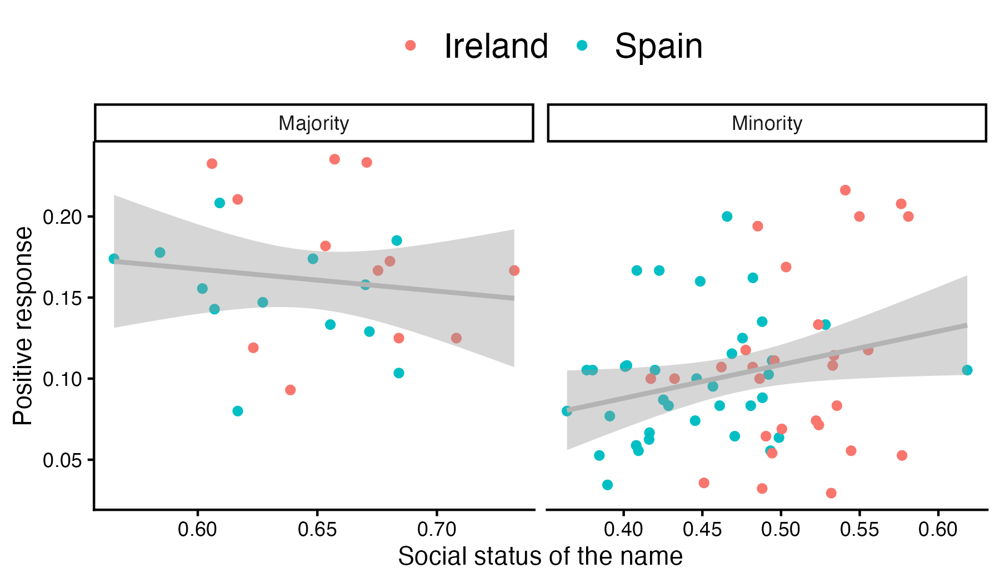{fig-align="center" width=80%}

## Model - SES

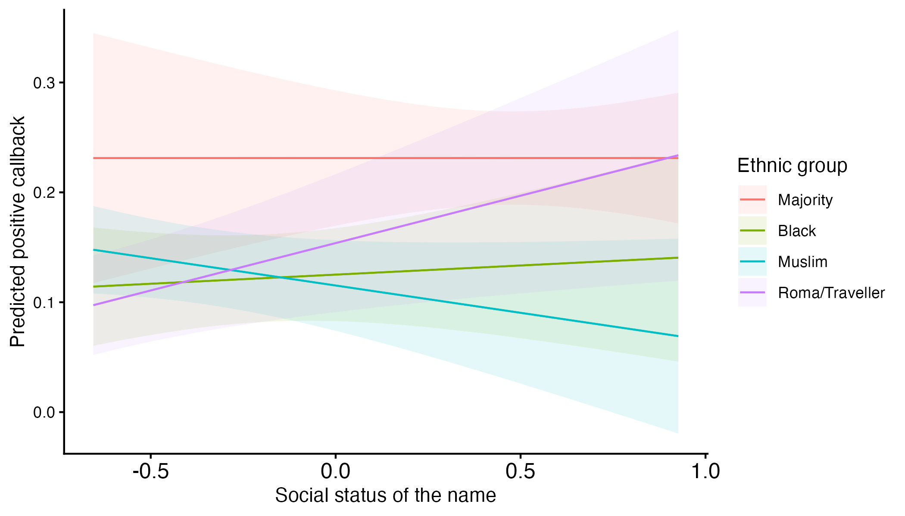{fig-align="center" width=90%}
